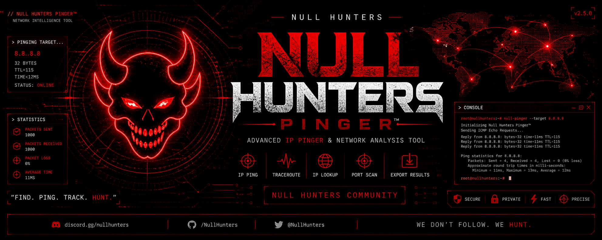
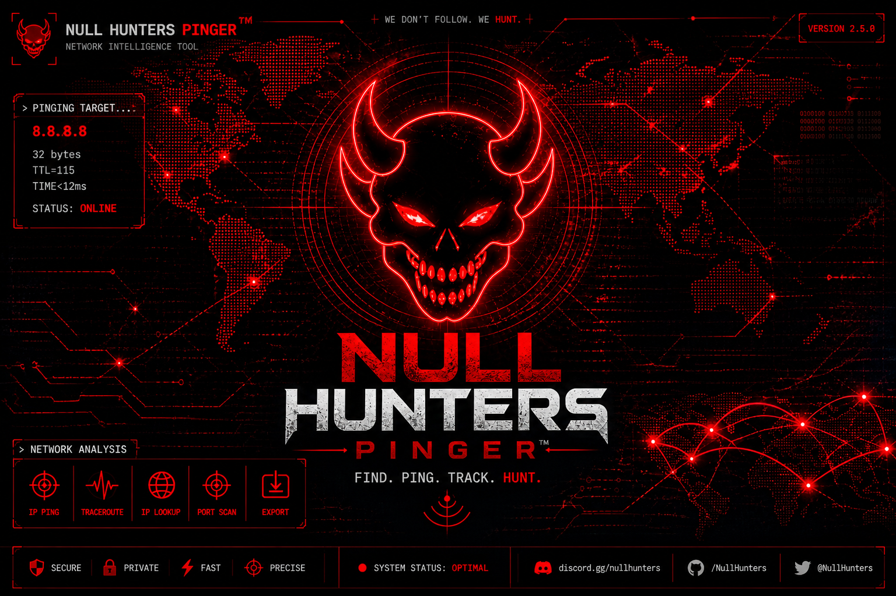
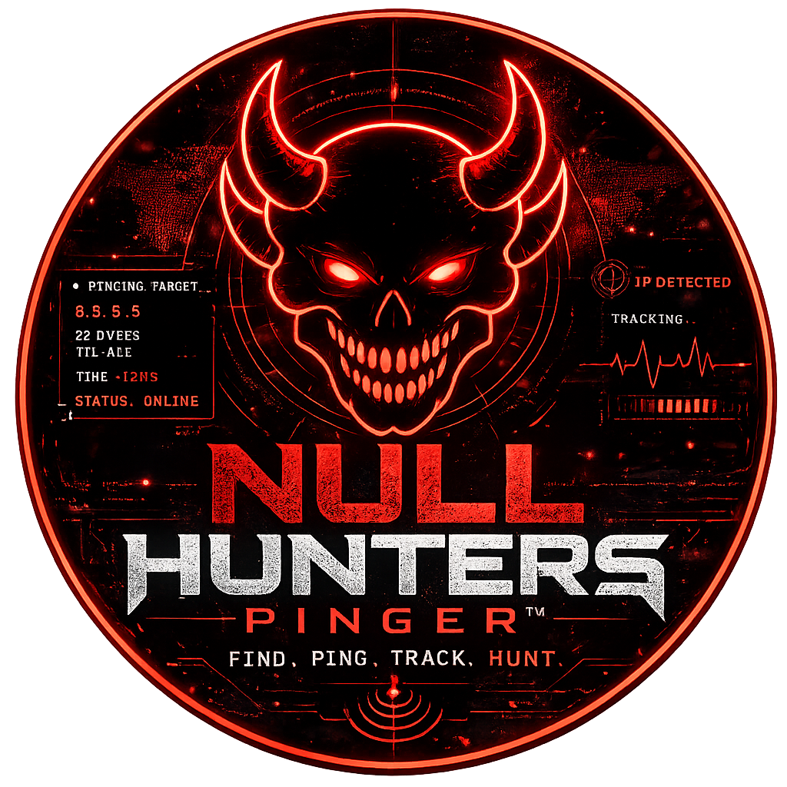

# 🩸 Null Hunters Pinger™

Advanced Real-Time Network Intelligence Tool  
Built for precision, control and deep diagnostics.

---

  

<h1 align="center">NULL HUNTERS PINGER™</h1>

  <b>Find • Ping • Track • Hunt</b>

---

  
  
  
  
  
  

---

## 🧠 Descripción

**Null Hunters Pinger™** es una herramienta avanzada de diagnóstico de red diseñada para análisis en tiempo real, monitoreo de latencia y visualización profesional.

Construida para ofrecer precisión, velocidad y control total sobre el estado de red, integrando telemetría en vivo, análisis de objetivos y un motor optimizado para diagnósticos rápidos.

---

## ⚡ Características

- ⚡ Ping en tiempo real
- 📡 Telemetría en vivo
- 📊 Estadísticas de latencia
- 🛰️ Sistema radar de red
- 🌍 Análisis de hosts
- 📁 Exportación de resultados
- 📌 Historial de objetivos
- 🔔 Detección Online / Offline
- 🧠 Diagnóstico inteligente
- 🔥 Interfaz estilo Null Hunters

---

## 🖥️ Vista del Sistema

  

---

## 📦 Descarga

Disponible en la sección **Releases**

**Archivo principal:**

`NullHuntersPinger.exe`

---

## ⚙️ Uso

1. Ejecuta el archivo `.exe`
2. Introduce una IP o dominio
3. Selecciona el protocolo
4. Presiona `START`
5. Visualiza los resultados en tiempo real

---

## 🧠 Estado del Sistema

| Módulo | Estado |
|-------|--------|
| Engine | ACTIVE |
| Telemetry | LIVE |
| Radar | ENABLED |
| Diagnostics | SMART |
| Performance | OPTIMAL |

---

## 🌐 Comunidad

- 👑 Owner: `@fb1.i`
- 🩸 Brand: **Null Hunters**
- 💬 Discord: https://discord.gg/Rfs9N3fya4
- 🌐 Web: https://guns.lol/nullhunters

---

## 👿 Branding

  

  <b>NULL HUNTERS</b> 
  Cybersecurity • Network Intelligence • Precision Tools

---

## ⚠️ Aviso

Este software debe utilizarse únicamente en redes propias, entornos autorizados o con fines educativos.

El uso indebido es responsabilidad del usuario.

---

## 📜 Licencia

Null Hunters MT License

---

## 🧬 Identidad

**Null Hunters © 2026**  
**We don’t follow. We hunt.**
